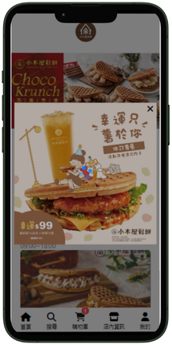

## 手機 App 點餐系統

### 廣告彈窗 & 載入畫面

* 剛進到首頁時有廣告彈窗和載入畫面效果

### 首頁

* 有輪播圖效果
* 點擊店家圖示可到各店家菜單內容
* 點擊訂單圖示可以查看訂單

### 訂單

* 可查詢不同店家的訂單

### 搜尋

* 以 tab 分類為搜尋商品和店家選項

### 購物車

* 以店家做分類，可瀏覽不同店家商品
* 可以增加/減少/刪除商品

### 店家資訊

* 可依地區搜尋店家或是在輸入框搜尋店名
* 點擊店家可以進到菜單頁面

#### 菜單頁面

* header部分可以看到店家評分和營業資訊
* 點擊不同分類字體會變成咖啡色

#### 商品頁面

* 飲料商品可選擇甜度、冰塊
* 鬆餅可選擇備餐方式

### 我的

* 使用JWT實現token登入驗證機制
* 使用者操作後的回饋機制(例登入成功message)
#### 個人資料

* 可以設定暗黑模式和英文模式
#### 編輯個人資料

* 可更改使用者姓名/帳號/名稱

### 模式

* 可以設定暗黑模式和英文模式
